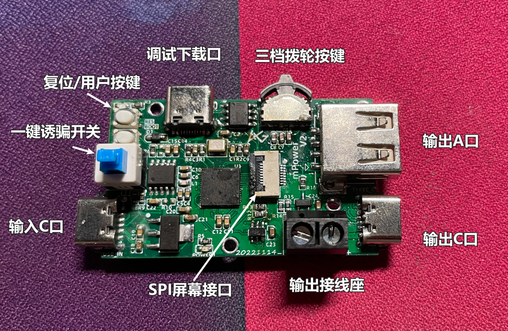
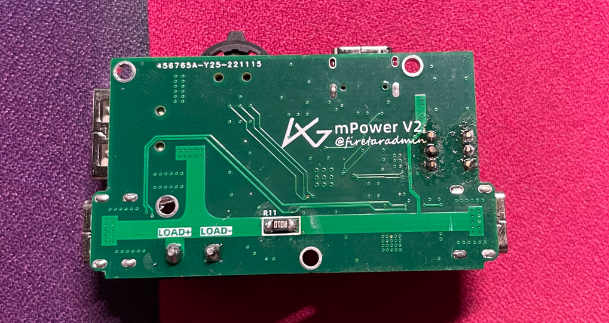
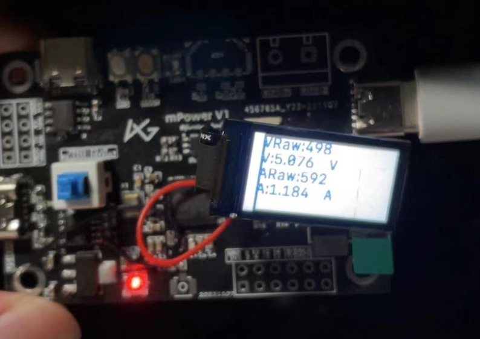

# mPower [USB-C功率计、快充诱骗器]

---

@firestaradmin 2022-12-14

**本项目已开源至Github：[点我传送](https://github.com/firestaradmin/mPower)**

---

[TOC]

## 1、简介：

**为什么叫 mPower 呢？**
首先mPower 可以看作是一个迷你的power 相关的东西吧，其次也是我喜欢的一款车--BMW mPower 4 （😄）

**功能介绍：**

首先是功率测量功能，顾名思义（USB-C功率计、快充诱骗器）它是一个USB-C 口的一个充电功率测量仪器，测量误差精确到`+-0.002 A/V`，但是DIY 作品并没有做偏差校准，所以并没有看上去那么精确，够用即可。

其次是PD快充协议诱骗功能，带有硬件开关一键诱骗，软件设置电压。如果快充适配器支持需要的电压就会输出该电压。

**硬件介绍：**

mPower 采用`ESP32-S2FH4`作为主控MCU，是一个单核 32 位 LX7 微处理器的 SoC，其内部集成4MB FLASH，支持WIFI 连接。

PCB 板载整合功能：USB串口电路、INA181电流检测芯片、一个SPI液晶屏幕IPX座子、一个输入端TYPE-C、一个输出TYPE-C、一个输出TYPE-A、一个输出正负极接线座子等

示意图：

 背面靓照如下：

> mPower 本身是非常迷你的，尺寸只有 5CMx3CM

## 2、硬件电路部分

硬件电路部分，需要注意的是大电流走线宽度一定要够，其余的都很基础，参考器件的官方手册都可以解决，这里就不一一展示了，电路全部开源在GitHub。

诱骗采用的是 CH224K，支持PD协议的诱骗。

## 3、软件部分

软件部分，是基于FreeRTOS 的一个乐鑫提供SDK下开发的，整体思路就是ADC采集电压电流，然后计算转换为实际的电压电流显示在屏幕上。

电压采集直接ADC采集输出端或输入端的电压即可。

电流采集通过INA181芯片采集一个高精度的10毫欧采样电阻的电压来计算电流。

具体程序也开源在GitHub。

## 4、调试过程

因为我在制作这个东东的时候已经在准备辞职的事情了，所以上图二代的照片并没有记录其过程，这里只有一张第一代的mPower 的调试照片，还很糊，hhh。

所以相应的，GUI界面也没有完善，但都是时间问题。

---

## X、作者的话

生活需要休息，迎接更好的挑战！

